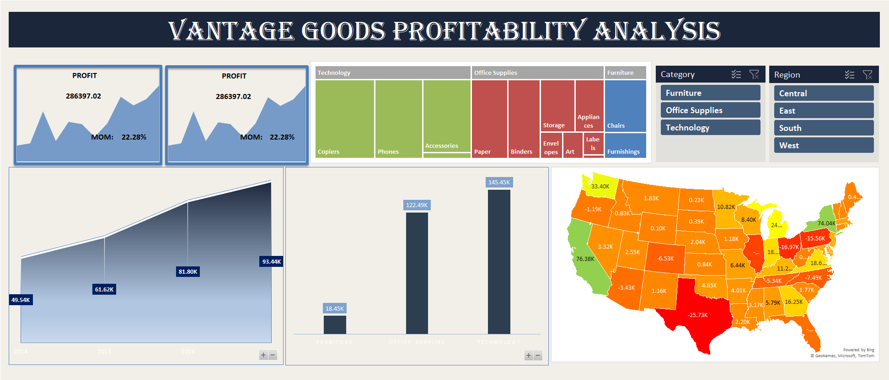

# Vantage Goods Profitability Analysis Dashboard

## Project Overview

This project provides a comprehensive analysis of the financial performance of **Vantage Goods** using **Microsoft Excel**. The objective was to transform raw retail data into a professional, interactive dashboard that identifies key profit drivers and areas of financial loss.

The analysis explores profitability across multiple dimensions including **time, geography, and product categories** to support data-driven decision making.

---

## Dataset

- **Source:** Retail sales and profit dataset  
- **Size:** 9,994 rows and 21 columns  
- **Key Fields:** Order Date, Region, State, Category, Sub-Category, Sales, Profit

---

## Data Preparation

To ensure accurate analysis, the following preprocessing steps were performed:

- **Data Cleaning:** Removed duplicates and handled missing values  
- **Feature Engineering:** Extracted **Year and Month** from the *Order Date* for time analysis  
- **Standardization:** Ensured consistent naming for regions, states, and product categories  
- **Calculations:** Created calculated fields for:
  - Year-over-Year (YoY) growth
  - Month-over-Month (MoM) profit percentage changes

---

## Analysis Performed

Using **Pivot Tables**, the following business questions were analyzed:

- **Profit Trends Over Time**  
  Analyzed annual and monthly profit performance from **2014 to 2017**

- **Geographic Profitability**  
  Identified high-performing and loss-making states

- **Product Hierarchy Analysis**  
  Evaluated profit contribution by **Category and Sub-Category**

- **Regional Performance**  
  Compared profitability across **Central, East, South, and West regions**

---

## Dashboard Features

An **interactive Excel dashboard** was designed with a premium **Midnight Navy & Slate Grey theme**.

Key elements include:

- **Dynamic Area Chart**  
  Visualizes profit trends over time

- **Interactive Map Visualization**  
  Displays profit distribution by state

- **Treemap & Sunburst Charts**  
  Shows category-wise profit contribution

- **KPI Cards**
  - Total Profit: **₹ 286.4K**
  - MoM Growth: **22.28%**

- **Interactive Slicers**  
  Allows filtering by **Category and Region**

---

## Key Business Insights

- **Total Profit:**  
  The business generated **₹ 286,397.02** in total profit.

- **Top Performing Category:**  
  **Technology** is the largest profit driver with **₹ 145,454.95**.

- **Best Performing Region:**  
  The **West Region** generated **₹ 108,418.45** in profit.

- **State-Level Performance:**  
  - **California** and **New York** show strong profitability  
  - **Texas** recorded the highest loss at **-₹ 25,729.36**

- **Low Margin Segment:**  
  The **Furniture category**, especially **Tables**, negatively impacts overall profitability.

---

## Tools Used

- **Microsoft Excel**
- **Pivot Tables**
- **Pivot Charts**
- **Slicers**
- **Data Cleaning & Transformation**
- **Dashboard Design & Data Visualization**

---

## Dashboard Preview

---

## Project Files

- `vantage-goods-dashboard.xlsx` — Full Excel dashboard and analysis  
- `dashboard-preview.png` — Dashboard screenshot
